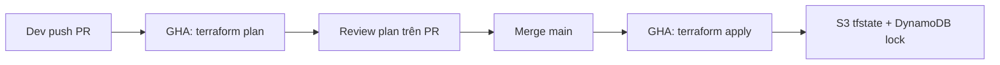

# Practice Terraform — Remote State + GitHub Actions

Setup production-style Terraform: **S3 remote state + DynamoDB lock** (nhiều người/CI cùng làm việc an toàn), và **GitHub Actions CI/CD** (plan trên PR, apply trên `main`) qua **OIDC** (không lưu AWS access key dài hạn).

## Cấu trúc

```
practice_terraform/
├── bootstrap/          # Chạy 1 lần (local state): tạo S3 + DynamoDB + IAM OIDC role
├── infra/              # Code infra chính — dùng remote backend
└── .github/workflows/  # Plan (PR) / Apply (push main)
```

**Vì sao tách bootstrap?** Bucket/table chứa state không thể nằm trong cùng state remote ngay từ đầu (chicken-and-egg). Bootstrap dùng local state một lần, rồi `infra/` trỏ vào S3.

## Flow



- **S3**: lưu `terraform.tfstate` (versioning + encrypt)
- **DynamoDB**: state lock — tránh 2 người `apply` cùng lúc làm hỏng state
- **OIDC**: GitHub Actions assume IAM role, không cần `AWS_ACCESS_KEY_ID` trong secrets

## Bước 1 — Bootstrap (máy local, 1 lần)

Cần AWS CLI đã login (`aws sts get-caller-identity` OK). Region mặc định: `ap-southeast-2`.

```bash
cd bootstrap
# terraform.tfvars đã có sẵn (hoặc copy từ .example rồi sửa)

terraform init
terraform apply
```

Lưu output:

- `state_bucket_name`
- `lock_table_name`
- `github_actions_role_arn` → sẽ set vào GitHub Secret

## Bước 2 — Cấu hình backend cho infra

Sửa `infra/backend.tf` cho khớp bucket/table/region vừa tạo, rồi:

```bash
cd infra
terraform init
terraform plan
# apply lần đầu có thể chạy local, hoặc để CI làm sau khi push
```

## Bước 3 — GitHub

1. Push repo lên GitHub (tên repo trùng `github_repo` trong tfvars).
2. Repo → **Settings → Secrets and variables → Actions** → tạo secret:
   - `AWS_ROLE_ARN` = output `github_actions_role_arn` từ bootstrap
3. (Optional) **Settings → Environments → production** — bật required reviewers nếu muốn approve trước apply.
4. Mở PR sửa gì đó trong `infra/` → xem job **Terraform Plan** + comment plan.
5. Merge `main` → job **Terraform Apply**.

## Lưu ý practice

- IAM policy trong bootstrap đang **rộng** (`*`) cho dễ học — production phải least privilege.
- Nếu account đã có GitHub OIDC provider, `aws_iam_openid_connect_provider.github` có thể conflict → `terraform import` provider sẵn có.
- Đừng commit `*.tfvars`, `*.tfstate`.
- Destroy demo: `cd infra && terraform destroy`. Bootstrap giữ lại nếu còn dùng remote state.

## Checklist nhanh

- [ ] `bootstrap/terraform.tfvars` đã điền đúng
- [ ] `terraform apply` ở bootstrap OK
- [ ] `infra/backend.tf` khớp bucket/table
- [ ] Secret `AWS_ROLE_ARN` trên GitHub
- [ ] PR → plan, merge → apply
